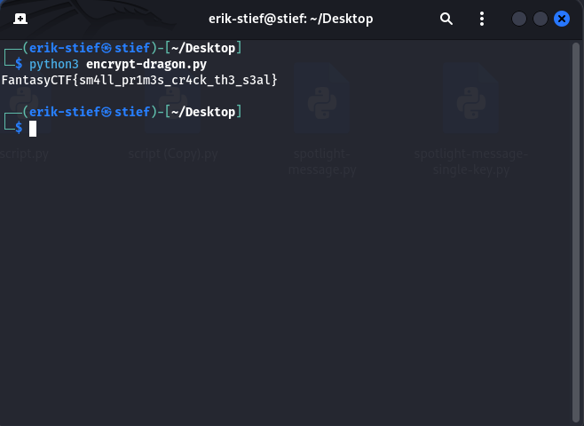

# The Dragon's Sealed Proclamation Writeup

## Challenge Details
- **Event:** ISSessions Fantasy CTF
- **Category:** Crypto
- **Author:** Chron0
- **Description:** The Dragon-King sealed his royal proclamation with an RSA cipher, trusting his court wizard to generate secure keys. But the wizard, in his laziness, used a deterministic and predictable method to choose his primes. The public parameters and ciphertext are provided. Break the seal.
- **Files provided:** `params.txt`, `encrypt.py`

## Objective
Examine the provided params.txt and encrypt.py files and decrypt the cipher text.

## Initial Analysis
I first opened the parameters text file and noticed n, e, c values. These values made me think of RSA but I wasn't totally sure until I looked at the provided script.
**ciphertext.txt**
```
n = 5164499756173817179311838344006023748659411585658447025677865354123030066900937972924127657878446787098787761770604048079
e = 65537
c = 78712649249983265019557465459887958171586810887099023878566621633784428086766844763540459751738708898204926310659868051
```

When looking at this code I noticed that I had the prime values p and q given to me as well as the n, e, and c values. Will all of these values given to me I knew I would be able to calculate all of the values and keys I would need to solve this challenge.
**encrypt.py**
```
from sympy import nextprime

def generate_weak_rsa():
    # The court wizard's "efficient" key generation
    p = nextprime(2**200 + 1337)
    q = nextprime(2**201 + 7331)
    n = p * q
    e = 65537
    return n, e

def encrypt(plaintext: str, n: int, e: int) -> int:
    plaintext_int = int.from_bytes(plaintext.encode(), 'big')
    ciphertext = pow(plaintext_int, e, n)
    return ciphertext

if __name__ == "__main__":
    n, e = generate_weak_rsa()
    flag = "REDACTED"
    c = encrypt(flag, n, e)

    with open("params.txt", "w") as f:
        f.write(f"n = {n}\n")
        f.write(f"e = {e}\n")
        f.write(f"c = {c}\n")

    print("RSA parameters written to params.txt")
```

## Solution
While I have been taught RSA before I needed to touch up on all of its steps to get to the solution of this problem. I found this link that broke it down into a relatively clean process: [RSA (explained step by step)](https://www.cryptool.org/en/cto/rsa-step-by-step/).

After reviewing RSA encryption I tried writing a script to decrypt this message. I broke my process down into 4 steps here so you can follow along with the script.
- Step 1: Calculate the totient phi(n) = (p - 1)(q - 1)
- Step 2: Compute the private key d using the modular inverse of e modulo phi(n) (I looked up a library to help me with this step, ended up using sympy)
- Step 3: Decrypt the ciphertext c using the private key d. The decryption formula is: c^d % n
- Step 4: Convert the decrypted plaintext integer back to a string. I assumed the original plaintext was encoded using UTF-8 (I was correct)


**Decrypt.py**
```
from sympy import mod_inverse
p = 1606938044258990275541962092341162602522202993782792835302841
q = 3213876088517980551083924184682325205044405987565585670610119
n = 5164499756173817179311838344006023748659411585658447025677865354123030066900937972924127657878446787098787761770604048079
e = 65537
c = 78712649249983265019557465459887958171586810887099023878566621633784428086766844763540459751738708898204926310659868051

phi_n = (p - 1) * (q - 1)
d = mod_inverse(e, phi_n)

plaintext_int = pow(c, d, n)

plaintext = plaintext_int.to_bytes((plaintext_int.bit_length() + 7) // 8, 'big').decode()

print(plaintext)
```

After running my script I received the challenges flag.

