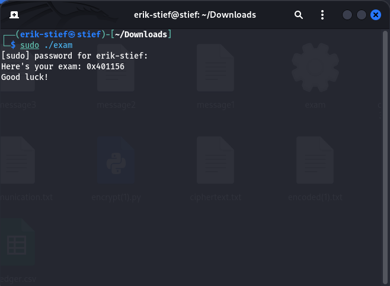
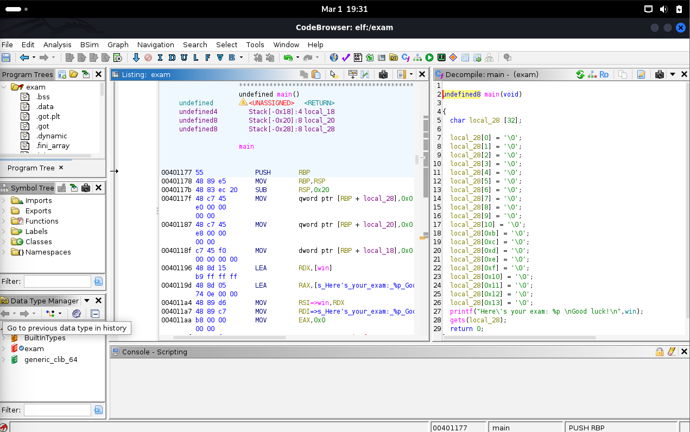
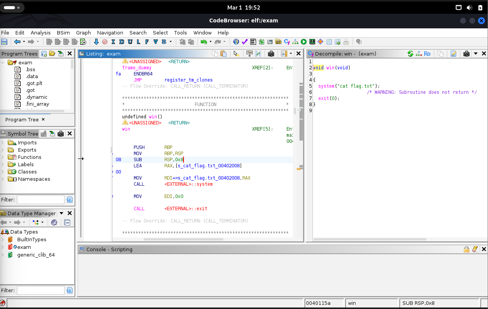
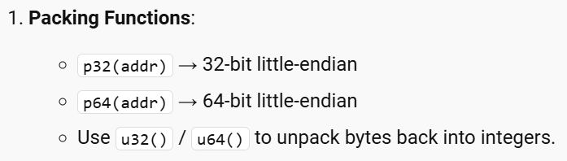
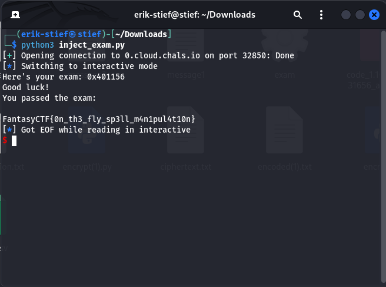

# Spellcraft Exam Writeup

## Challenge Details
- **Event:** ISSessions Fantasy CTF
- **Category:** Pwn
- **Author:** 3354
- **Description:** It's exam week at the Academy, and you're checking in for your spellcrafting final. You get full marks if you can hit the target with a simple Air Strike, but there's a twist: the target is out of your line of sight. In fact, it's behind a wall. You realize quickly that you need to improvise: you need to modify the incantation for Air Strike to alter its pathway to go behind the wall and return back to hit the target. Can you figure it out and get full marks?
- **Files provided:** `exam`
- **Server provided:** `nc 0.cloud.chals.io 32850`

## Objective
Examine the provided exam executable and use the hosted server to find the hidden flag.

## Initial Analysis
I started this challenge off by running the executable in my terminal, it printed out a memory address `0x401156`.


I then opened the executable within Ghidra to gain an understanding of what the executable is doing. There was a lot of code that I wasn't able to understand or find the purpose of, but eventually I located a main function.

Using a combination between the decompiled c code and assembly code, I noted a few key functionalities. First I noticed some Stack variables that Ghidra labeled at offsets like `-0x28`. The stack was something I was familiar with in theory but this was my first time attempting to interact with it outside of class. Another important feature I noticed in the c code was the `gets` function call, due to solving a previous challenge I knew I could exploit this function using a buffer overflow.
I also noticed that the Main function references a sub function called `win`.

I noticed right away that this function referenced `cat flag.txt`. So I believed this function had something to do with the solution.
At this point I was getting a little lost when attempting to find a solution to this challenge.
So I collected what I had, a memory address printed by `main`, some variables pushed onto the stack, and a `gets` call that allows for buffer overflow. It was only after I decided to reread `main` that I noticed that the memory address printed out was the memory address of `win`. I realized I would most likely have to interact with `gets` and this memory address to access the functionality of `win` but I wasn't sure how. This is when a Sponsor who was watching me think through this challenge suggested I look at how the stack works with this executable. While researching the stack and x64 assembly I came across this link that helped me understand how certain registers interact with the stack: [Linux x64 Calling Convention: Stack Frame](https://www.ired.team/miscellaneous-reversing-forensics/windows-kernel-internals/linux-x64-calling-convention-stack-frame).

While this article wasn't super helpful in solving this question it did give me an idea to write a stack diagram of `main` after the function executes.

**Main Assembly Code**
```
PUSH RBP
MOV RBP, RSP
SUB RSP, 0x20
```
**stack diagram**
```
High Addresses
+-----------------------+----------+-----------------------------------+
|    Return Address     |  8 bytes | [RBP + 0x08]                      |
+-----------------------+----------+-----------------------------------+
|       Saved RBP       |  8 bytes | [RBP + 0x00] ← RBP points here    |
+-----------------------+----------+-----------------------------------+
|                       |          |                                   |
| Allocated Stack Space | 32 bytes | [SUB RSP, 0x20] ← gets() starts   |
|                       |          |                                   |
|                       |          |                                   |
+-----------------------+----------+-----------------------------------+
Low Addresses                                     ← RSP points here
```
So with this basic understanding of how `main` interacts with the stack, all of the clues I had collected started to fall into place.
This is the point I started curating my solution.

## Solution
Using the basic stack diagram I developed above, I wanted to somehow overwrite that return address using the buffer overflow vulnerability created by `gets`. I remembered from a previous challenge(Words of Power) that manually entering a buffer overflow into the terminal would not work, so I decided to attempt to write a script to inject my own payload. As seen in the stack diagram there is a 40 byte buffer between where `gets` writes and where I need to overwrite the return address, so I started by filling my payload with 40 (0x28) A chars. I then appended the return address of `win` that main provides when you run the executable. It took me a while to figure out how to properly send memory addresses, but I eventually came across packing functions in pwntools.


With this I was able to complete my script.

** inject_exam.py**
```
from pwn import *
payload = b'A' * 0x28 + p64(0x00401156)
p = remote('0.cloud.chals.io', 32850)
p.sendline(payload)
p.interactive
```

I then ran my script in the terminal resulting in the challenge flag.

