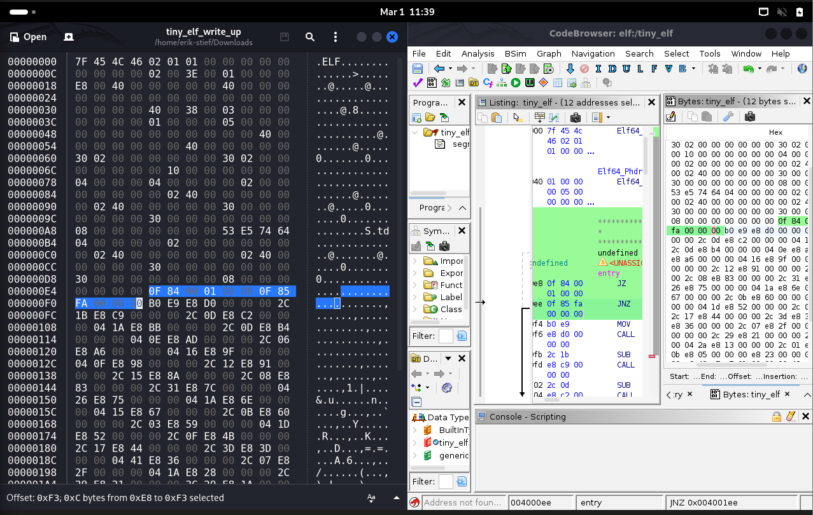
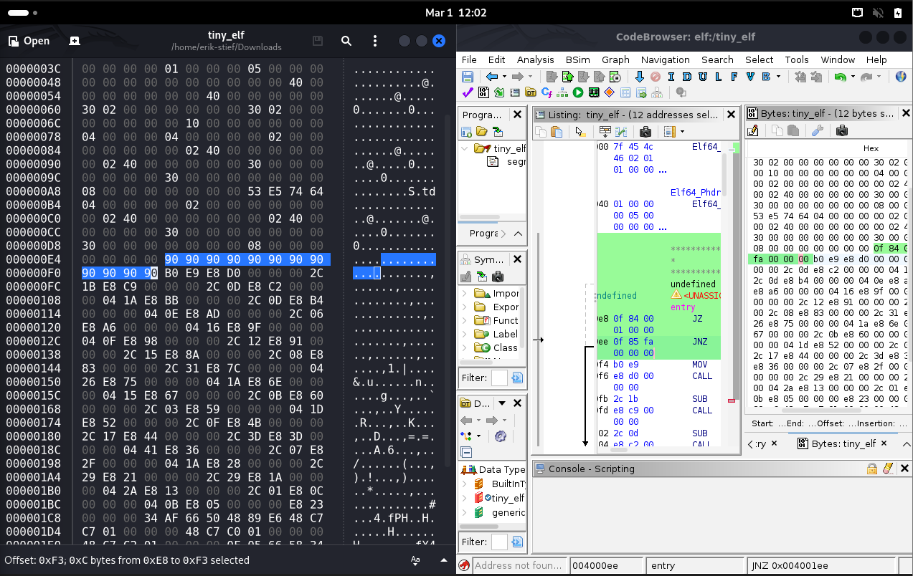
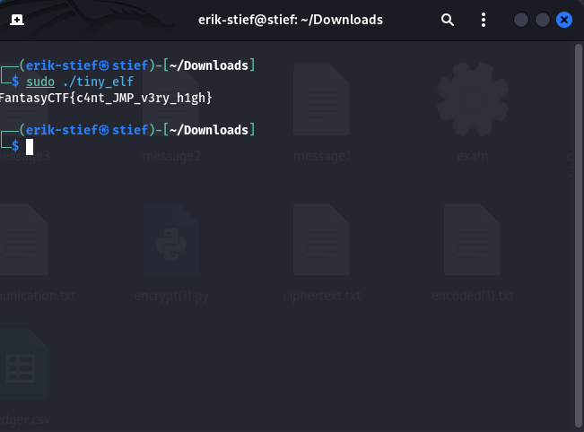

# Tiny Elf Writeup

## Challenge Details
- **Event:** ISSessions Fantasy CTF
- **Category:** Reverse Engineering
- **Author:** 3354
- **Description:** On your travels, you come across (perhaps) the tiniest elf you've ever met!
What secrets can it tell you?
- **Files provided:** `tiny_elf`

## Objective
Examine the provided tiny_elf executable to find the hidden flag.

## Initial Analysis
After downloading the executable I attempted to run it, resulting in nothing happening. I then decided to open the executable in Ghidra, which decompiled into assembly allowing me to analyze what the program is doing. With my first analysis I noticed a main function that called two sub functions.

Main was relatively easy to understand, it started with a jump if zero and jump if not zero to the first sub function, then it would set the AL register as a memory location and call the second sub function. After the initial MOV the function would repeatedly SUB from AL and CALL the second sub function and end with a CALL to the first sub function.
**Main**
```
JZ FUN_004001ee
JNZ FUN_004001ee

MOV AL, [Memory-Address]
CALL FUN_004001cb

SUB AL, [Memory-Address]
CALL FUN_004001cb
.
.
.
CALL FUN_004001ee
```

Sub-Function 1 required me to do a bit of research before completely understanding what it was doing as I am not super familiar with `x86_64 Linux`. Through my research into this code I found that this is an exit sequence, it sets RDI to 0 for a successful status code and RAX to 60 to initiate the `sys_exit`. At this point I already had a good idea as to why the program was not running correctly.
**Sub-Function 1 (FUN_004001ee)**
```
MOV RDI, 0x0
MOV RAX, 0x3c
SYSCALL
```

Sub-Function 2 was easier to read as I have come across XOR encryption before. I just needed to understand what the `SYSCALL` was doing. After a bit of research I came to the understanding that the function was printing a single character to `stdout` using `sys_write`.
**Sub-Function 2 (FUN_004001cb)**
```
XOR AL, 0xaf
PUSH AX
MOV RSI, RSP
MOV RDI, 0x1
MOV RAX, 0x1
MOV RDX, 0x1
SYSCALL
POP AX
XOR AL, 0xaf
RET
```

## Solution
Through my analysis of the different functions I realized Sub-Function 2 was never running due to the two jumps at the start of Main. So I started looking into how I could edit the code to avoid these jumps. 
This was my first time using Ghidra to this extent, so I started looking for functionality that would allow me to remove these jumps from the function. Unfortunately I wasn't able to find anything to help me edit this code in Ghidra. After this I discussed my problem with others at the CTF and a Hex editor was suggested to me.

After a quick search for hex editors I installed GHex on my machine and opened the executable with this new tool.
Using a combination of Ghidra and GHex I was able to locate the hex values I needed to change.


Initially I changed these values to 00 (0x00), but soon came to the realization this would lead to a either a shift in the binary or some weird behavior with the jumps. I would like to gain a better understanding how changing hexadecimal values can alter functionality as I found this topic very interesting.

My next thought came from the research project I did in my CPU Arch class that I took last semester. With a partner I researched a class of vulnerabilities known as Spectre, some of the solutions we researched recommended padding Hex with NOP (0x90). 
So with this idea, I edited the jump hex to be 90 (0x90) instead.


I then ran the executable in the terminal resulting in the challenges flag.
